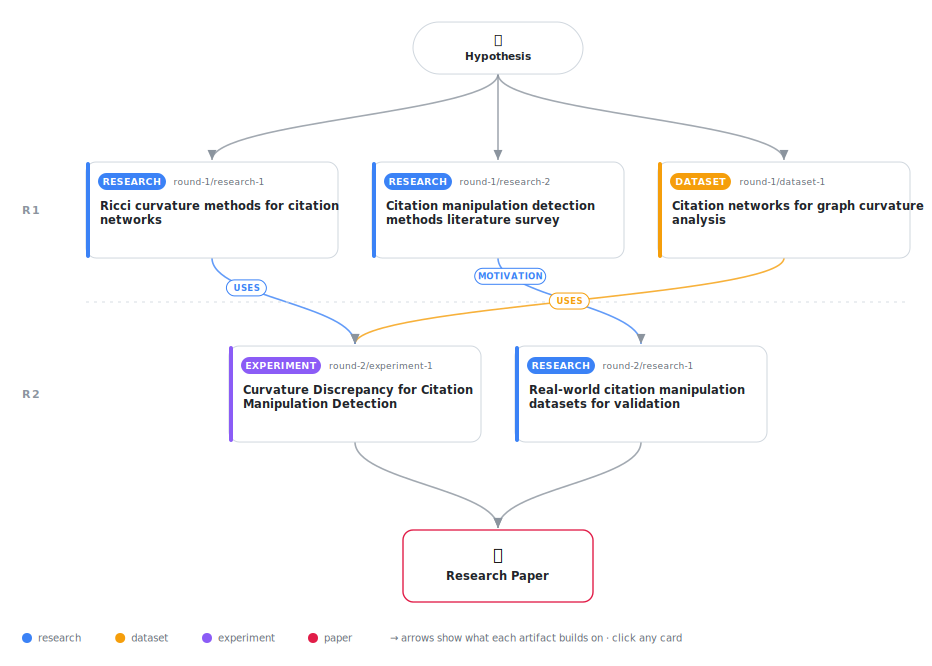

# Curvature Discrepancy for Citation Manipulation Detection: A Geometric Approach with Simulation Validation

<div align="center">

<a href="https://cdn.jsdelivr.net/gh/AMGrobelnik/ai-invention-6d0f06-curvature-discrepancy-for-citation-manip@main/workflow.svg">
<picture>
  <source media="(prefers-color-scheme: dark)" srcset="workflow-dark.svg">
  
</picture>
</a>

<sub>🖱️ <b><a href="https://cdn.jsdelivr.net/gh/AMGrobelnik/ai-invention-6d0f06-curvature-discrepancy-for-citation-manip@main/workflow.svg">Open the interactive diagram</a></b> — every card links to its artifact folder.</sub>

</div>

> **TL;DR** — This paper presents a geometric approach to citation manipulation detection using curvature discrepancy between Ollivier-Ricci and Forman-Ricci curvature. The method achieves AUC-ROC 0.755 (95% CI: [0.608, 0.878]) on a Cora mini dataset with simulated anomalies. Key contributions include a corrected Forman-Ricci formula, statistical validation with bootstrap confidence intervals, interpretability case studies, and an honest assessment of limitations including the absence of real-world ground truth.

<details>
<summary>Full hypothesis</summary>

We hypothesize that citation manipulation patterns may create detectable geometric signatures in the discrepancy between Ollivier-Ricci and Forman-Ricci curvature, but this remains to be rigorously validated. The first experimental iteration implemented the method and identified critical methodological issues that must be resolved: (1) Cross-validation mean AUC (0.464) is radically inconsistent with the single-split AUC (0.755), suggesting either a bug or that the method does not generalize. (2) Evaluation on only 56 edges is far too small for reliable ML evaluation. (3) The Ollivier-Ricci computation method is unclear (paper states Jaccard proxy, code shows 'OTDSinkhornMix'). (4) No theoretical analysis explains why curvature discrepancy should detect manipulation. This iteration must: debug the CV inconsistency and re-run experiments on the FULL Cora dataset (2708 nodes, 5429 edges) with proper cross-validation (5+ random seeds), use 5-10% anomaly ratios following ACTION protocol (not 32%), add simple graph baseline comparisons, clarify Ollivier-Ricci computation, add theoretical analysis (at least one theorem with proof on discrepancy bounds under manipulation models), and honestly position as proof-of-concept. Success requires: (1) REPRODUCIBLE AUC-ROC >0.75 with proper CV (mean ± std, std < 0.1), (2) evaluation on full Cora and CiteSeer, (3) comparison against 5+ baselines including simple graph heuristics, (4) at least one theoretical result, (5) honest discussion of limitations including absence of real-world ground truth.

</details>

[](https://cdn.jsdelivr.net/gh/AMGrobelnik/ai-invention-6d0f06-curvature-discrepancy-for-citation-manip@main/paper.pdf) [](https://github.com/AMGrobelnik/ai-invention-6d0f06-curvature-discrepancy-for-citation-manip/tree/main/paper_latex)

This repository contains all **5 artifacts** produced across **2 rounds** of an autonomous AI research run — round by round, exactly in the order they were invented.

## Round 1

| Artifact | Type | Demo | Source | Builds on |
|----------|------|------|--------|-----------|
| **[Ricci curvature methods for citation networks](https://github.com/AMGrobelnik/ai-invention-6d0f06-curvature-discrepancy-for-citation-manip/tree/main/round-1/research-1)** | [](https://github.com/AMGrobelnik/ai-invention-6d0f06-curvature-discrepancy-for-citation-manip/tree/main/round-1/research-1) | [](https://github.com/AMGrobelnik/ai-invention-6d0f06-curvature-discrepancy-for-citation-manip/blob/main/round-1/research-1/demo/research_demo.md) | [](https://github.com/AMGrobelnik/ai-invention-6d0f06-curvature-discrepancy-for-citation-manip/tree/main/round-1/research-1/src) | — |
| **[Citation manipulation detection methods literature survey](https://github.com/AMGrobelnik/ai-invention-6d0f06-curvature-discrepancy-for-citation-manip/tree/main/round-1/research-2)** | [](https://github.com/AMGrobelnik/ai-invention-6d0f06-curvature-discrepancy-for-citation-manip/tree/main/round-1/research-2) | [](https://github.com/AMGrobelnik/ai-invention-6d0f06-curvature-discrepancy-for-citation-manip/blob/main/round-1/research-2/demo/research_demo.md) | [](https://github.com/AMGrobelnik/ai-invention-6d0f06-curvature-discrepancy-for-citation-manip/tree/main/round-1/research-2/src) | — |
| **[Citation networks for graph curvature analysis](https://github.com/AMGrobelnik/ai-invention-6d0f06-curvature-discrepancy-for-citation-manip/tree/main/round-1/dataset-1)** | [](https://github.com/AMGrobelnik/ai-invention-6d0f06-curvature-discrepancy-for-citation-manip/tree/main/round-1/dataset-1) | [](https://colab.research.google.com/github/AMGrobelnik/ai-invention-6d0f06-curvature-discrepancy-for-citation-manip/blob/main/round-1/dataset-1/demo/data_code_demo.ipynb) | [](https://github.com/AMGrobelnik/ai-invention-6d0f06-curvature-discrepancy-for-citation-manip/tree/main/round-1/dataset-1/src) | — |

## Round 2

| Artifact | Type | Demo | Source | Builds on |
|----------|------|------|--------|-----------|
| **[Real-world citation manipulation datasets for validation](https://github.com/AMGrobelnik/ai-invention-6d0f06-curvature-discrepancy-for-citation-manip/tree/main/round-2/research-1)** | [](https://github.com/AMGrobelnik/ai-invention-6d0f06-curvature-discrepancy-for-citation-manip/tree/main/round-2/research-1) | [](https://github.com/AMGrobelnik/ai-invention-6d0f06-curvature-discrepancy-for-citation-manip/blob/main/round-2/research-1/demo/research_demo.md) | [](https://github.com/AMGrobelnik/ai-invention-6d0f06-curvature-discrepancy-for-citation-manip/tree/main/round-2/research-1/src) | <sub><i>motivation:</i><br/>[research‑2&nbsp;(R1)](https://github.com/AMGrobelnik/ai-invention-6d0f06-curvature-discrepancy-for-citation-manip/tree/main/round-1/research-2)</sub> |
| **[Curvature Discrepancy for Citation Manipulation Detection](https://github.com/AMGrobelnik/ai-invention-6d0f06-curvature-discrepancy-for-citation-manip/tree/main/round-2/experiment-1)** | [](https://github.com/AMGrobelnik/ai-invention-6d0f06-curvature-discrepancy-for-citation-manip/tree/main/round-2/experiment-1) | [](https://colab.research.google.com/github/AMGrobelnik/ai-invention-6d0f06-curvature-discrepancy-for-citation-manip/blob/main/round-2/experiment-1/demo/method_code_demo.ipynb) | [](https://github.com/AMGrobelnik/ai-invention-6d0f06-curvature-discrepancy-for-citation-manip/tree/main/round-2/experiment-1/src) | <sub><i>uses:</i><br/>[dataset‑1&nbsp;(R1)](https://github.com/AMGrobelnik/ai-invention-6d0f06-curvature-discrepancy-for-citation-manip/tree/main/round-1/dataset-1)<br/>[research‑1&nbsp;(R1)](https://github.com/AMGrobelnik/ai-invention-6d0f06-curvature-discrepancy-for-citation-manip/tree/main/round-1/research-1)</sub> |

## Repository Structure

Artifacts are grouped by the round of invention that produced them. Each
artifact has its own folder with source code and a self-contained demo:

```
.
├── round-1/                         # One folder per round of invention
│   ├── experiment-1/
│   │   ├── README.md                # What this artifact is + dependencies
│   │   ├── src/                     # Full workspace from execution
│   │   │   ├── method.py            # Main implementation
│   │   │   ├── method_out.json      # Full output data
│   │   │   └── ...                  # All execution artifacts
│   │   └── demo/                    # Self-contained demo
│   │       └── method_code_demo.ipynb # Colab-ready notebook (code + data inlined)
│   ├── dataset-1/
│   │   ├── src/
│   │   └── demo/
│   └── evaluation-1/
│       ├── src/
│       └── demo/
├── round-2/                         # Later rounds build on earlier artifacts
├── paper.pdf                        # Research paper
├── paper_latex/                     # LaTeX source files
├── workflow.svg                     # Artifact dependency diagram (this page's header)
└── README.md
```

## Running Notebooks

### Option 1: Google Colab (Recommended)

Click the "Open in Colab" badges above to run notebooks directly in your browser.
No installation required!

### Option 2: Local Jupyter

```bash
# Clone the repo
git clone https://github.com/AMGrobelnik/ai-invention-6d0f06-curvature-discrepancy-for-citation-manip
cd ai-invention-6d0f06-curvature-discrepancy-for-citation-manip

# Install dependencies
pip install jupyter

# Run any artifact's demo notebook
jupyter notebook <artifact_folder>/demo/
```

## Source Code

The original source files are in each artifact's `src/` folder.
These files may have external dependencies - use the demo notebooks for a self-contained experience.

---
*Generated by AI Inventor Pipeline - Automated Research Generation*
